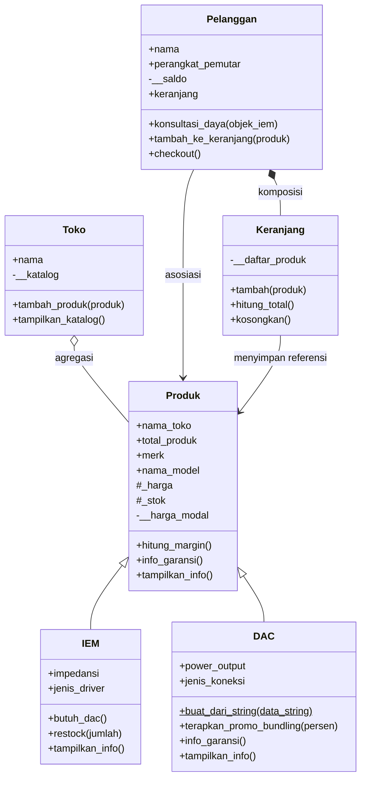

# Posttest 2 - Pemrograman Berorientasi Objek

## Audiophile HS Store: Relasi UML & Inheritance

Program ini melanjutkan judul Posttest 1 (sistem toko audio IEM dan DAC). Pada Posttest 2, class `IEM` dan `DAC` direfaktor menjadi **subclass** dari superclass `Produk`, serta ditambahkan class `Toko` dan `Keranjang` agar relasi UML (Asosiasi, Agregasi, Komposisi) dapat diterapkan.

## Class Diagram



## Penerapan Relasi UML

| Relasi | Class | Penjelasan |
|---|---|---|
| Asosiasi | `Pelanggan` dan `Produk` (`IEM`) | `Pelanggan` hanya menggunakan objek produk lewat parameter method (`konsultasi_daya(objek_iem)` dan `tambah_ke_keranjang(produk)`). Tidak ada kepemilikan, dan kedua objek hidup sendiri-sendiri. |
| Agregasi | `Toko` dan `Produk` | `Toko` menyimpan daftar produk di `__katalog`, tetapi produk dibuat di luar `Toko` lalu dimasukkan lewat `tambah_produk()`. Saat objek `toko` dihapus, produk tetap ada (dibuktikan di akhir program). |
| Komposisi | `Pelanggan` dan `Keranjang` | `Keranjang` dibuat di dalam `Pelanggan.__init__` (`self.keranjang = Keranjang()`). Keranjang tidak punya arti tanpa pelanggan dan ikut hilang bersama pemiliknya. |

## Penerapan Inheritance

| Ketentuan | Penerapan |
|---|---|
| Superclass | `Produk` |
| Subclass (minimal 2) | `IEM` dan `DAC` |
| `super().__init__(...)` | Dipanggil di constructor `IEM` dan `DAC` untuk mengisi `merk`, `nama_model`, `harga`, `stok`, dan `harga_modal` |
| Atribut unik | `IEM`: `impedansi`, `jenis_driver`. `DAC`: `power_output`, `jenis_koneksi` |
| Method overriding | `tampilkan_info()` di-override oleh `IEM` dan `DAC` (memanggil `super()` lalu menambah info spesifik). `info_garansi()` di-override oleh `DAC` dengan garansi 12 bulan, sedangkan `Produk` memberi 6 bulan |
| Protected (`_nama`) | `_harga` dan `_stok` di `Produk`. Dimanipulasi langsung oleh subclass: `IEM.restock()` mengubah `_stok`, `DAC.terapkan_promo_bundling()` mengubah `_harga` |
| Private (`__nama`) | `__harga_modal` di `Produk`. Hanya bisa diakses lewat `hitung_margin()` milik superclass, sehingga subclass dan kode luar tidak bisa membacanya langsung |

## Source Code

Lihat file [`main.py`](main.py). Seluruh konsep Posttest 1 (class method, static method, property getter/setter, validasi) tetap dipertahankan.

## Output Program

```text
=== Selamat Datang di Audiophile HS Store ===

[UJI AGREGASI: Toko memiliki Produk]
Jumlah produk di katalog: 4
[KATALOG AUDIOPHILE HS STORE]
Kinera Wyvern Celest | Rp350000 | Stok: 10
   -> Tipe: IEM | Impedansi: 32 Ohm | Driver: Dynamic Driver
Sennheiser IE200 | Rp2500000 | Stok: 5
   -> Tipe: IEM | Impedansi: 60 Ohm | Driver: Dynamic Driver
Fiio BTR15 | Rp1800000 | Stok: 8
   -> Tipe: DAC | Output: 340mW | Koneksi: Bluetooth
Moondrop DawnPro | Rp800000 | Stok: 4
   -> Tipe: DAC | Output: 120mW | Koneksi: USB-C

[UJI INHERITANCE & METHOD OVERRIDING]
Garansi IEM : Garansi toko 6 bulan
Garansi DAC : Garansi resmi DAC 12 bulan (lebih panjang dari garansi toko)
isinstance(iem1, Produk) = True
isinstance(dac1, Produk) = True
isinstance(iem1, DAC)    = False

[UJI ASOSIASI: Pelanggan menggunakan IEM]

--- Sesi Konsultasi: Hammam ---
Perangkat Anda: Samsung Galaxy A13
Target IEM    : Kinera Wyvern Celest (Impedansi: 32 Ohm)
>> HASIL: IEM ini RINGAN. Bisa langsung dicolok ke HP/Laptop Anda tanpa masalah daya.

--- Sesi Konsultasi: Syamil ---
Perangkat Anda: Laptop Asus VivoBook
Target IEM    : Sennheiser IE200 (Impedansi: 60 Ohm)
>> HASIL: IEM ini BERAT. HP/Laptop Anda mungkin tidak kuat. Sangat disarankan membeli DAC tambahan!

[UJI KOMPOSISI: Pelanggan memiliki Keranjang]
[Keranjang Hammam] Wyvern Celest ditambahkan.
[Keranjang Syamil] IE200 ditambahkan.
[Keranjang Syamil] BTR15 ditambahkan.

--- Checkout: Hammam ---
   1. Kinera Wyvern Celest - Rp350000
   Total: Rp350000 | Setelah diskon member: Rp315000
[Validasi Sukses] Stok Wyvern Celest berhasil diubah menjadi 9.
>> Pembayaran berhasil. Sisa saldo Hammam: Rp185000

--- Checkout: Syamil ---
   1. Sennheiser IE200 - Rp2500000
   2. Fiio BTR15 - Rp1800000
   Total: Rp4300000 | Setelah diskon member: Rp3870000
>> Pembayaran GAGAL. Saldo Syamil (Rp3000000) tidak cukup.

[UJI ATRIBUT PROTECTED DI SUBCLASS]
[Restock] Stok Wyvern Celest bertambah 5, sekarang 14.
[Promo] Harga BTR15 turun 10% menjadi Rp1620000.

[UJI ATRIBUT PRIVATE DI SUPERCLASS]
Margin IE200 via method superclass: Rp400000
Akses langsung ke __harga_modal dari luar class -> AttributeError

[UJI CLASS METHOD & STATIC METHOD]
Total produk terdaftar: 4
Total pelanggan: 2
Diskon member untuk semua pelanggan diubah menjadi 15.0%
Estimasi cicilan DAC Fiio BTR15 selama 6 bulan: Rp 270000.0
Validasi nama merk 'Fiio': True

[UJI GETTER, SETTER & VALIDASI]
>> Menguji input SALAH:
[Validasi Gagal] Stok Wyvern Celest tidak boleh negatif!
[Validasi Gagal] Stok Wyvern Celest harus berupa angka!
[Validasi Gagal] Harga BTR15 harus angka lebih dari 0!
[Validasi Gagal] Saldo Hammam tidak boleh negatif!

>> Menguji input BENAR:
[Validasi Sukses] Stok Wyvern Celest berhasil diubah menjadi 15.
[Validasi Sukses] Harga BTR15 berhasil diubah menjadi Rp1700000.
[Validasi Sukses] Saldo Hammam berhasil diisi.

>> Cek data setelah diupdate via Getter:
Stok akhir Wyvern Celest = 15
Harga akhir BTR15 = Rp1700000
Saldo akhir Hammam = Rp800000

[BUKTI AGREGASI: Produk tetap ada walau Toko dihapus]
Toko dihapus, produk masih ada: Kinera Wyvern Celest
```

## Cara Menjalankan

```bash
python main.py
```